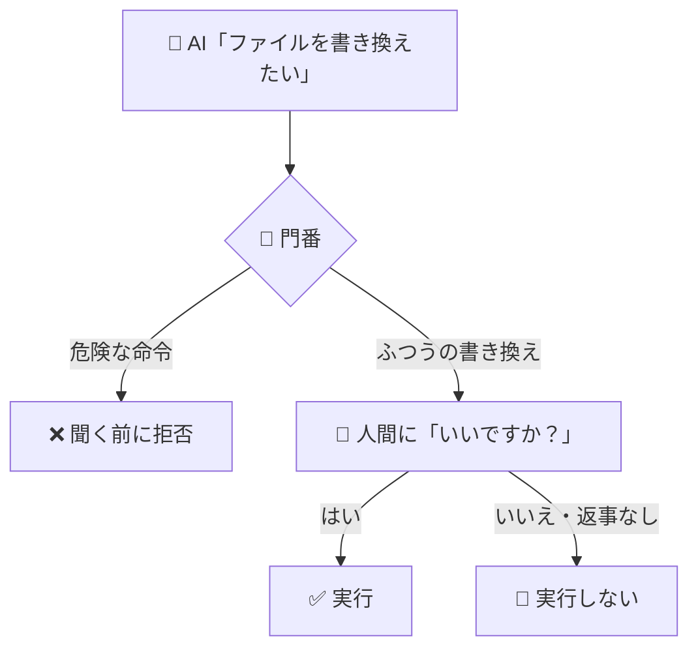

<!-- published: 2026-09-06 / 種別: できごと（新仕様） / 対象: NexusCoreエージェントハーネス Phase 2-3 -->

# AIにファイルを書き換えさせる前に「いいですか？」と聞かせる話

## 困ったこと

AIに作業を任せていると、ファイルの中身を書き換えたり、パソコンに命令を打ち込んだりする力が必要になる。ところが、その力を渡した瞬間に「人間が見ていないところで勝手に書き換える」という怖さが生まれる。さらに厄介だったのは、作った仕組みを確かめるテストは全部成功していたのに、いざ実際に動かす経路では**必ず**落ちるという、見つけにくい欠陥が潜んでいたことだ。テストが成功しているからといって安心できない、というのが一番の困りごとだった。

## どう解決したか

まず門番を作った。AIがファイルを書き換えようとした瞬間に作業を止めて「いいですか？」と人間に聞く。そして、聞ける環境になければ黙って実行を諦める。危険な命令（全部消す・管理者権限・履歴を書き換える系）は、人間に聞く前の段階ではねる仕組みにした。

次に、別々のAI三体に「この仕組みの弱点を探して」と頼んだ。すると一体が「テストでは全部動くのに、実際に動かすと必ず壊れる場所」を見つけた。テストに使っていた道具と、本番で使う道具が別物で、本番側の受け渡しが最初から壊れていたのだ。さらに別のレビュアーが「ここが壊れている」と主張した箇所は、実際のコードを開いて確かめたら**嘘**だった。指摘を鵜呑みにせず、証拠をつけて退けた。

## 何が変わったか

AIは作業中、書き換えの前に必ず確認してくるようになった。「はい」と答えれば書き換え、「いいえ」や返事なしであれば絶対に書き換わらない。本当に試してみたら、拒否したあとAIは「編集は適用されませんでした」と自分から正直に報告してきた。危険な命令は、人間の目に触れる前にはねられる。

頼む側としては「ちゃんと聞いてくれる」安心ができたので、もっと大きな仕事をまとめて任せられるようになった。AIの力を止めるのではなく、力に鍵を付ける。この体験の一番の収穫は、それだった。

▶ 技術的にどう作ったか

NexusCoreエージェントハーネスのPhase 2-3（実装計画27タスクのTask 17-20）として実装。

- **書く系道具**（write_file/edit_file）: 原子書込（一時ファイル→置換で書込途中死でも元ファイル保護）・symlink拒否・1MB上限・非UTF-8保護・edit複数マッチは実行せず報告
- **ask確認フロー**: select(2)によるstdin監視でタイムアウト=deny・非TTY環境（CI/パイプ起動）はチャネル不在として即denyの二重防御
- **撃つ系道具**（run_command）: ToolGate deny_patterns（禁止コマンド部分一致でaskに上げず即DENY・非list型はfail-closed deny-all）+タイムアウト60秒+出力末尾5KB保持+stdin=DEVNULL
- **3機マルチLLMレビュー**: 各TaskでMiniMax+Gemini+OpenRouterに同一プロンプトで独立レビュー（計87指摘→採用25件）。critical実バグ2件（既定reader引数不一致=本番経路で必ずTypeError・encoding未指定によるバイナリ出力クラッシュ）は「テストが注入モジュール経由のみでGREENする偽陰性構造」から発見。レビュアーのハルシネーション1件（_iter_arg_stringsが文字単体イテレート、という主張）は実コード参照で反証し実測覆しとして台帳記録
- **E2E検証**: 疑似TTY（scriptコマンド）+実プロバイダでask承認→ファイル実改変・拒否/タイムアウト→無変更を両経路実測

詳細な設計記録は自身のSSOT（非公開）にあり、変更履歴はNexusCoreリポジトリ（GitHub公開）で確認できる。

