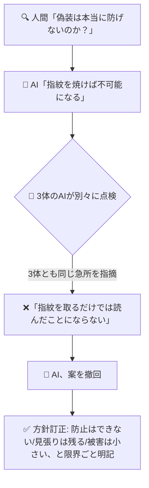

<!-- published: 2026-09-07 / 種別: できごと（判断収束） / 対象: マルチLLMレビュー3ラウンド（r1→r3） -->

# AIの直し提案が3体そろって否定された話

## 困ったこと

AIに作業を任せていると、AIが手順を省略するという失敗が起きた。毎回やるはずの確認作業を、AIは「頭の中でやったつもり」になっていて、実際には何も見ていなかった。人間が質問して初めて発覚する、見えないサボりだ。そこで「確認を忘れられない仕組み」を作ろうと、AIに設計案を考えさせ、さらに別々のAI三体に「この案の弱点を探して」と頼んだ。ところが案が固まった後、依頼者から一つの問いかけを受ける。「悪意ある偽装は本当に起こらないのか？」——この一言で、設計は根っから揺さぶられることになった。

## どう解決したか

AIは「起こりうる。三つの場面がある」と分析し直し、「証拠の電子指紋を合言葉に焼き付ければ、読まずに偽装することは不可能になる」という直し案を出した。これを三体のAIに見せたところ、**三体そろって同じ急所を突いた**。「指紋を取るのは中身を読まない機械作業なので、指紋だけ取れば読んだことにはならない」。案の根幹は間違いだった。AIは案を取り下げ、方針を組み替えた。指紋は「設定が新しくなったことの検知」にだけ使い、意図的な偽装は「完全には防げない。でも見張りの記録は残るし、万が一すり抜けても被害は記録の質が下がる程度」と、限界ごと明記した設計に変えた。

## 何が変わったか

出来上がったのは「構造的に不可能です」という安心できる嘘ではなく、「ここまでは守る・ここから先は守れない」と限界を書いた設計だった。頼む側としては一瞬不安になったが、限界が書いてある方が逆に信頼できる。破壊的な被害につながる箇所ではないと被害の大きさを見積もった上で、残る危険を受け入れる判断は人間がした。

一番の収穫は、AIが自分の提案を**すぐに取り下げられた**ことだ。ただ深いAIは、賛成を集めるのが得意すぎて、間違いを認めるのが苦手だと言われる。今回は三体が別々に、それも同じ場所を指摘したから覆せた。一体的な点検は、AIにAIの間違いを認めさせる最も短い道だった。

▶ 技術的にどう作ったか

- **対象**: 自作の記録支援スキルにおいて、LLMが定型的な確認手順（設定マッピング2ファイルの読込）を省略した事故の再発防止設計
- **三層設計（r1〜r3で最終化）**: ①判定スクリプト化（タグ照合をスクリプトが行い、出力JSON+output_id+sha256を返す・エラー時は非0でmarker発行なし）②書込ゲート（markerはスクリプト自身が発行・セッションID別・未取得時はfail-closedで全面block・マッピング更新後の古いmarkerはmtime+ハッシュの再計算照合で拒否）③事後監査（新規スクリプトが運用正典に掲載済みかを双方向照合・日次で3層自己テストも実施）
- **r3での撤回**: 「markerへsha256を焼けば読まずに偽装は構造的に不可能」という設計者（LLM）の主張に対し、3レビュアーが別々に「sha256計算は内容解釈を伴わず読了を証明しない」とcritical指摘（MiniMax/Gemini/OpenRouter・計20指摘）。主張を撤回し、ハッシュはstale検知用途に限定・積極的偽装は「防止不能・検知可能・影響中低」として明示的にリスク受容する方針へ訂正
- **計測**: 3ラウンド累計77指摘（採用28/部分21/却下17+設計者主張撤回1）・判断収束台帳にingest済み
- 詳細な設計記録は自身のSSOT（非公開）にあり、このガイドから内部リポジトリへの到達経路は遮断している

