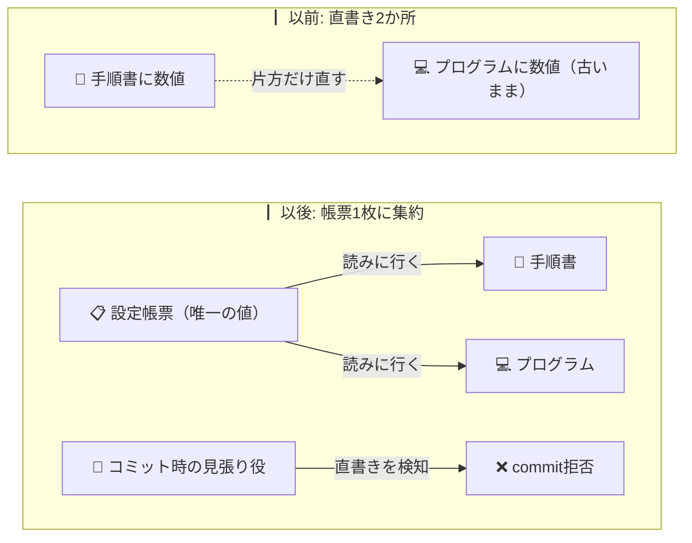

<!-- published: 2026-09-07 / 種別: できごと（反復解消） / 対象: レビュー統合共有化（G1〜G3・review_policy.yaml） -->

# 設定を1枚の帳票に集めて書き忘れ事故を潰した話

## 困ったこと

AIの振る舞いを決める数値（どのモデルを使うか・どこまで許すか等）が、手順書と実行プログラムの**2か所**に同じように書かれていた。片方だけ直してもう片方を直し忘れる事故が実際に起きた。直したつもりが直っていない——増えていく設定のたびに、この事故の確率は上がっていく。「二か所に同じことを書くな」という原則は分かっていても、手順書は人間とAIが読む文章、プログラムは機械が読むコードで、形が違うために分かれてしまっていた。

## どう解決したか

まず、散らばった値を**1枚の帳票（設定ファイル）に集めた**。次に、手順書とプログラムの両方に「値は帳票を見に行く」ように書き換えた。手順書には「作業前に帳票を必ず読むこと」を先頭に置き、プログラムには帳票が読めない・壊れている時に**黙って諦めず停止する**番兵を付けた。さらに、帳票に関係するファイルが触られたコミットの瞬間に、見張り役が「まだ帳票を見に行かず値を直接書いていないか」を機械で検査するようにした。実際に値を直接書き込んでコミットを試したところ、見張り役がちゃんと止めてくれた。現行の設定値が帳票と完全に一致していることも、検査コード19本と18本で保証した。

## 何が変わったか

設定を直す場所が**1か所**になった。手順書もプログラムも同じ帳票を見に行くので、「もう片方を直し忘れる」という事故の起き方そのものが、物理的にできなくなった。変わったのは事故の起き方だけではない。コミットしようとした瞬間に見張り役が止めてくれるので、間違いが外の世界に出る前に気がつける。

もう一つの変化は小さいけど大事で、設定を変える時に「帳票を直せばいい」と全員が分かるようになったこと。どこを直せばいいか分からないシステムでは、直すこと自体ためらわれる。1か所になると、変える勇気も出る。ちなみに今この話を読んでいるガイドの仕組み自体もAIが運用しているが、設定の正本を1枚に集める発想は、AIに任せる仕事ほど効いてくる。

▶ 技術的にどう作ったか

- **対象**: 自作の複数LLMレビュー運用におけるポリシー値（モデル一覧・判定閾値・severity正規化・出力スキーマ等）の2重管理解消
- **正本**: `review_policy.yaml`（claude-config repo・version 1.1.0）。手順書（SKILL.md）は「作業前の強制Read手順+version照合（作業ツリーと最新コミットのversion比較）」、実行ライブラリ（review_lib.py）は `load_review_policy()` 新設（パス解決は環境変数→配置場所由来→固定候補の順・ホワイトリスト外は即abort・未知キーは即abort（Strict）・7種のerror_typeでfail-fast+エラーJSONL記録・`--expected-version`必須）
- **pre-commitゲート**: YAML構文検証→動的直書きgrep（YAMLから値リストを抽出し手順書/ライブラリ内の出現を検出・数値はキー名との複合マッチで偽陽性防止）→pytestの3段。fixture（直書きあり3/なし3）で自己点検可能。実測: SKILL.mdに直書きを注入したcommitが実際に拒否されることを確認
- **テスト**: 一致保証テスト19ケース（G2・参照化後契約に更新）+ローダテスト18ケース（G3・TDDでRED→GREEN）+ゲート自己点検。YAML値自体は変更なし（非変性を実測）
- **開発プロセス**: 設計specは3機レビュー7ラウンド約207件で収束・実装は3段階ゲート（抽出→一致保証→参照化）を別コミットで完遂
- 詳細な設計記録は自身のSSOT（非公開）にあり、このガイドから内部リポジトリへの到達経路は遮断している

