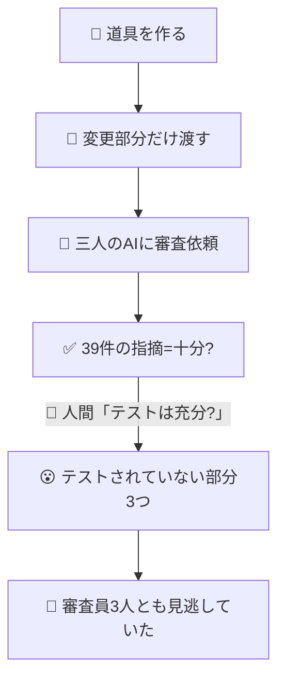
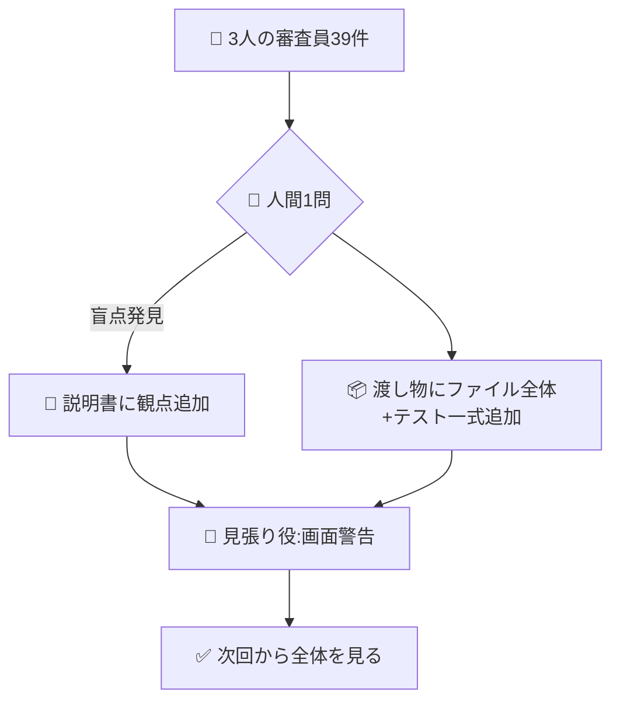

<!-- published: 2026-09-07 / 種別: できごと（事故解決+反復解消） -->

# AI審査員の盲点を人間の一言と説明書の改良で塞いだ話

## 困ったこと

ある日、状態表示の道具を作り、三人の別々のAIに「変なところを探して」と頼んだ。返ってきた指摘は三体で合計39件。内容的にも技術的にも的確で、一見「これで十分」に見えた。ところが、その日の終わりにかけた、ふと出た一言が状況をひっくり返す。「**テストは充分？**」——道具が壊れた時の表示も、警告の予告行も、特定の操作パスの分岐も、**誰も一つも指摘していなかった**。三人の審査員は全員、渡された「変更した一部分」しか見ておらず、「道具全体の振る舞い」のうちテストされていない領域を、一度も列挙しようとしなかった。見落としというより、**見える範囲が最初から限られていた**。

## どう解決したか

道具を直す前に、問題が起きた理由を分解した。「審査員が盲点を持った」のは、怠けでも能力不足でもなかった。二つの仕組みの穴が同時に開いていた。一つは**渡し物**が不完全だったこと。渡したのは「変更した一部分」だけ。道具全体と既存のテスト一式を見せなければ、「テストされていない部分」を探す動機も素材も生まれない。もう一つは**頼み方**に「テストされていない部分を挙げよ」との一言が無かったこと。人間は頼まれたことしかやらない——AIも同じ。三つの審査は優秀だったが、頼まれた範囲の中だけで優秀だった。

そこで審査の説明会書に、二行だけ書き足した。一つは頼み方の観点として「**テストされていない部分（多ければ上位三つ）を挙げよ**」を加え、もう一つは渡し物の注記として「**変更だけでなくファイル全体とテスト一式を渡せ**」を添えた。これで次回からは、最初から全体を見て、足りていない所を聞くようになる。

そして再発を物理的に防ぐ番人を一つ置いた。毎朝立ち上がる画面に「説明書が五百五十行を超えたら警告」を出す小さな仕掛けだ。行数そのものは今四百八十行で正常範囲。だから今日は何も警告が出ないが、知らないうちに膨れ上がった日には、画面が教えてくれる。人間の注意力に頼らない、構造の見張り役。

## 何が変わったか

一番変わったのは、「審査は頼まれた範囲で動く」という、当たり前の認識だ。今までは審査に「変な所を探して」とお願いすれば、十分な答えが返ると思っていた。それが間違いだった。「**何を範囲とするか**」をこちらが指定しなければ、AIの目は限られた窓からしか覗けない。言い換えれば、審査の精度を上げるには審査員を賢くするのではなく、**頼み方**と**渡し物**を賢くする必要がある。

副次的だが、もう一つ良かったことがある。人間の一言を待たず、システム自身が次に同じ穴を塞ぐ準備ができたことだ。「行数が膨らんだら警告」という単純な仕組みは、五分もあれば作れた。「LLMの思考を完璧にする」を目指すより、よほど早く、よほど確実で、よほど静かだ。

▶ 技術的にどう作ったか

- **対象**: 内部の「複数のAIに審査させる仕組み」の説明書（multi-llm-review SKILL.md）
- **発見経路**: 状態表示ツール（proxy-mode）に「動作モードの実効状態を併記する」機能を追加した際、3機レビュー（合計39指摘）で実装の欠陥は網羅されたが、テストの網羅性に関する盲点が露出。人間の「テストは充分？」1問で、3件のテストされていない領域（プロキシ死亡時表示・警告予告行・特定パス分岐）が発見された
- **追加した観点**: コードレビュー時に「未テスト領域の列挙（対象機能の全挙動を黒箱列挙→テスト存在を照合→欠落を上位3件に限定して報告）」を必須化・指摘の膨張を抑制するため3件限定
- **追加した入力素材**: 「差分だけでなく**対象ファイル全体+既存テスト一式**」も渡すこと。差分だけでは道具全体の挙動が見えず列挙が空回りする
- **防止装置**: 朝に表示される立ち上げ画面に、「説明書の行数が五百五十を超えたら」「特定セクションが八十行を超えたら」警告を出す小さな仕組みを追加。1ファイル数行の追加で実装でき、毎朝自動で確認が回る
- **判断の重み**: 3機のレビューは **0.5ラウンドで収束**（本命AIが指摘ゼロ=合意・残り2機も実測で覆せる些末のみ）し、軽微な修正で完了した。「重い仕組み」を作る前に「軽い仕組み」を先に置くのが、個人の環境では割に合うという知見
- 詳細な設計記録は非公開のSSOTにあり、このガイドから内部リポジトリへの到達経路は遮断している

